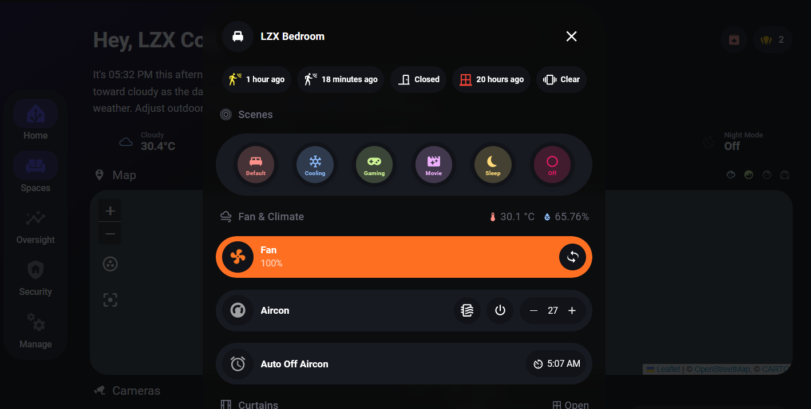

---
layout:  /src/layouts/ProjectLayout.astro
title: 'Smartifying My Home'
pubDate: 2025-10-20
description: 'Using Home Assistant to make my home smarter!'
languages: []
image:
  url: "/images/projects/homeassistant.svg"
  alt: "Home Assistant"
--- 

I have felt that some dull and minor annoyances that I have to perform daily could be automated. There were also appliances that were labelled 'Smart Devices' while also relying on a constant internet connection to a cloud server that could shutdown at any time.

That changes thanks to the [**Open Home Foundation**](https://www.openhomefoundation.org/), who developed the [**Home Assistant**](https://www.home-assistant.io/) platform.

It allows me to run my own server and leverage locally connected devices without relying on the internet or cloud servers!

## 🏡 Dashboard

Making use of the template provided by [HA Dashboard](https://youtu.be/W1bq6pqMCrI) to create a good-looking and clean dashboard for both Desktop and Mobile usage.

## 📊 Monitoring

Utilizing tools to monitor and visualize statistical information of sensor data.

- [InfluxDB](https://github.com/hassio-addons/addon-influxdb)
- [Grafana](https://github.com/hassio-addons/addon-grafana)

## 🖥️ Automations

Developed home automations to make my life easier and leveraged the data collected during the monitoring phase to enhance calibration of timings and debouncing.

- [Native Home Assistant Automations](https://www.home-assistant.io/docs/automation/)
- [NodeRED](https://github.com/hassio-addons/addon-node-red)
- [N8N](https://n8n.io/)

## 🔮 Future Plans

I plan on making a Home-Wide Automated Documentation system. It will leverage the use of a locally run LLM to document all of the items, sensors, scripts, and automations that are running throughout the home. This will save time on documenting and allows for more quicker linking of different systems and better debugging of scripts and automations in the home.