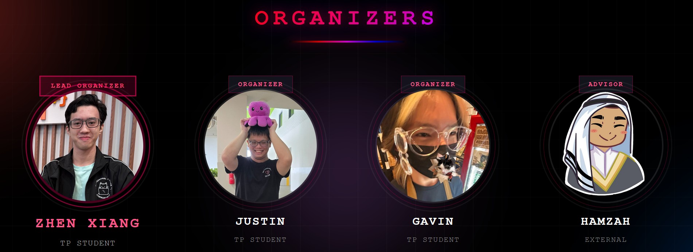
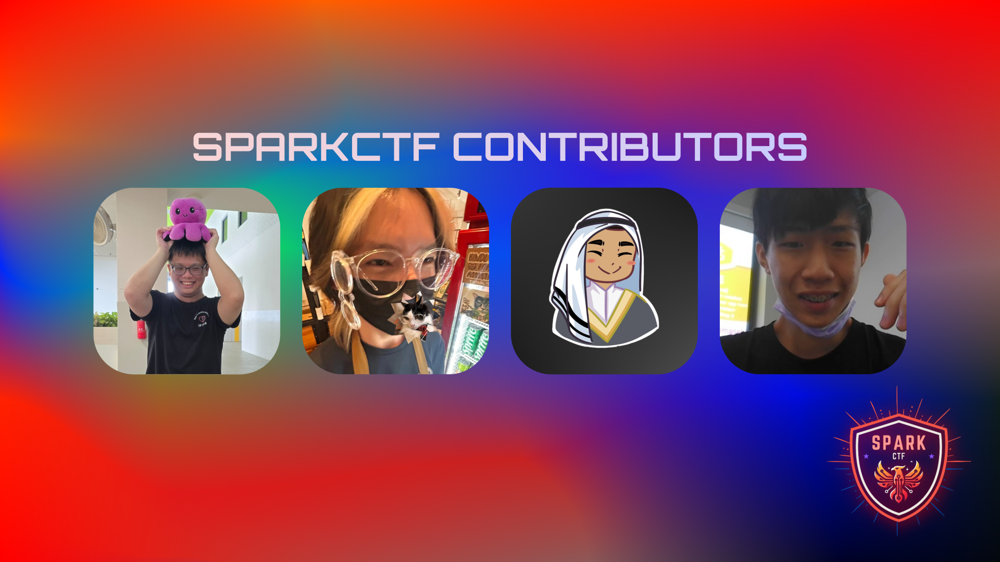

**SparkCTF** is a **jeopardy-style** CTF competition, designed for Year 1 to Year 3 **Cybersecurity & Digtal Forensics students** to sharpen their skills and demonstrate their ability to quickly adapt and learn concepts within the time constraint of a regular CTF.

There is also an **Experiential Track** for newly matriculated Year 1's to kickstart their interest into Cybersecurity.

This CTF was initiated through the **Cybersecurity and Digital Forensics Student Interest Group (CDFSIG)**.

## SparkCTF 2.0

### Organizers and Collaborations

**SparkCTF 2.0** is the 2nd iteration of the CTF, with the same SparkCTF Committee Team that brought the first ever SparkCTF!



Their professional socials are linked below:

- **Organizer:** [Justin How](https://www.linkedin.com/in/justin-how-291155241/)
- **Organizer:** [Gavin Tan](https://www.linkedin.com/in/gavintjh/)
- **Advisor:** [Sayed Hamzah](https://www.linkedin.com/in/sayedhamzah/)

### Obstacles

The 2nd iteration of SparkCTF presents both new obstacles and issues that need to be solved to ensure the competition goes smoothly.

1. **Manual Infrastructure Setup**

   Setting up the infrastructure from scratch over and over again is a painstaking process which wastes both time and the ever-previous DigitalOcean cloud money. The solution that we came up with was to utilize **Infrastructure as Code (IaC)** tooling such as Terraform and Ansible to automate the provisioning of cloud resources and the setting up of the virtual cloud instances with the relavent CTFd and service-based challenges. This reduces both the workload, maintenance and the overall cost of setting up the infrastructure.

2. **Service Downtime**

   Previously, there was no way of knowing when a service-based challenge goes down unless manually checked or when a ticket brings our attention to it. To solve this, from SparkCTF 2.0 onwards we introduced the **Prometheus and Grafana stack** to have a **centralized dashboard** showing all running services and their health and Prometheus Alerting for Discord Webhook alerts. It will **immediately alert** our team to fix the service in the shortest time possible, **reducing downtime** and a better overall experience for the participants.

   In the future, we will be making use of a container orchestration tool for **automated deployments and self-healing** for service-based challenges. This will be implemented as part of the **SparkCTF 2.0 Experiential Track** and to be fully implemented during SparkCTF 3.0

## First Iteration of SparkCTF

### Contributors

**SparkCTF** wouldn't have existed if not for my fellow co-organizers that helped make this CTF into a reality!



Their professional socials are linked below:

- **Organizer:** [Justin How](https://www.linkedin.com/in/justin-how-291155241/)
- **Organizer:** [Gavin Tan](https://www.linkedin.com/in/gavintjh/)
- **Advisor:** [Sayed Hamzah](https://www.linkedin.com/in/sayedhamzah/)
- **Creator:** [Joseph Lee](https://www.linkedin.com/in/joseph-lee-58646a283/)

### Obstacles

There were several obstacles that my team had to overcome to make the first SparkCTF competition possible.

1. **Creating Challenges**

   Our small team of 4 had to create over 60 challenges within a 2 month timeframe. We also did not have the resources to outsource challenge creation. This was eventually solved thanks to our co-organizers for also contributing challenges for the CTF.

2. **Infrastructure**

   Funnily enough, the infrastructure wasn't an issue. Rather, the cost of hosting the infrastructure was a concern for us. We eventually chose to use [DigitalOcean](https://www.digitalocean.com/) since the [GitHub Student Pack](https://education.github.com/pack) gives $200 in platform credits, which is more than enough to host the whole infrastructure.

3. **Limited Staff**

   We were short-staffed with the support tickets. Thankfully, there were few to no support tickets that were opened during the competition.

## Challenges Created

```cardlink
url: https://github.com/LZXCorp/SparkCTF/tree/2025-05
title: "GitHub - LZXCorp/SparkCTF"
description: "The official challenges for SparkCTF: Experiential Track in May 2025."
host: www.github.com
favicon: https://github.githubassets.com/favicons/favicon.svg
image: https://opengraph.githubassets.com/ec17df9f5991f13a93c7b0cfff0e00027155c015467dc4a4689eec5354bd05d6/LZXCorp/SparkCTF
```

```cardlink
url: https://github.com/LZXCorp/SparkCTF/tree/2024-12
title: "GitHub - LZXCorp/SparkCTF"
description: "The official challenges for SparkCTF in Dec 2024."
host: www.github.com
favicon: https://github.githubassets.com/favicons/favicon.svg
image: https://opengraph.githubassets.com/ec17df9f5991f13a93c7b0cfff0e00027155c015467dc4a4689eec5354bd05d6/LZXCorp/SparkCTF
```

## List of Organized SparkCTF Competitions

1. **SparkCTF**

- Lead Organizer
- Hosted on Dec 2024
- 36 hour timeframe to complete challenges
- For Year 1's to Year 3's

2. **SparkCTF: Experiential Track**

- Hosted on May 2025
- 111 hours timeframe to complete challenges
- For newly matriculated Year 1's only

3. **SparkCTF 2.0**

- Lead Organizer
- Hosted on Dec 2025
- 36 hour timeframe to complete challenges
- For Year 1's to Year 3's

## Infrastructure

_Coming Soon :)_
