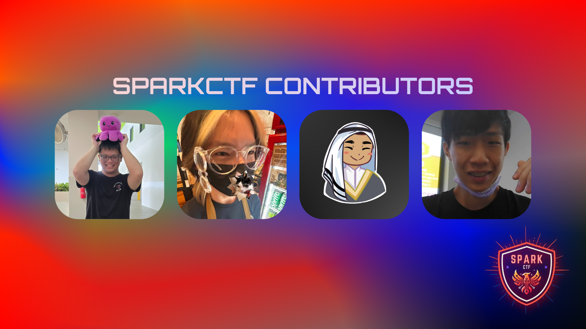

**SparkCTF** is a **jeopardy-style** CTF competition, designed for Year 1 to Year 3 **Cybersecurity & Digtal Forensics students** to sharpen their skills and demonstrate their ability to quickly adapt and learn concepts within the time constraint of a regular CTF.

There is also an **Experiential Track** for newly matriculated Year 1's to kickstart their interest into Cybersecurity.

This CTF was initiated through the **Cybersecurity and Digital Forensics Student Interest Group (CDFSIG)**.

## Co-Organizers and Collaborators

**SparkCTF** wouldn't have existed if not for my fellow co-organizers that helped make this CTF into a reality!



Their professional socials are linked below:
- **Co-Organizer:** [Justin How](https://www.linkedin.com/in/justin-how-291155241/)
- **Co-Organizer:** [Gavin Tan](https://www.linkedin.com/in/joseph-lee-58646a283/)
- **Advisor:** [Sayed Hamzah](https://www.linkedin.com/in/sayedhamzah/)
- **Creator:** [Joseph Lee](https://www.linkedin.com/in/joseph-lee-58646a283/)

## Challenges Created

```cardlink
url: https://github.com/LZXCorp/SparkCTF/tree/2025-05
title: "GitHub - LZXCorp/SparkCTF"
description: "The official challenges for SparkCTF: Experiential Track in May 2025."
host: www.github.com
favicon: https://github.githubassets.com/favicons/favicon.svg
image: https://opengraph.githubassets.com/ec17df9f5991f13a93c7b0cfff0e00027155c015467dc4a4689eec5354bd05d6/LZXCorp/SparkCTF
```

```cardlink
url: https://github.com/LZXCorp/SparkCTF/tree/2024-12
title: "GitHub - LZXCorp/SparkCTF"
description: "The official challenges for SparkCTF in Dec 2024."
host: www.github.com
favicon: https://github.githubassets.com/favicons/favicon.svg
image: https://opengraph.githubassets.com/ec17df9f5991f13a93c7b0cfff0e00027155c015467dc4a4689eec5354bd05d6/LZXCorp/SparkCTF
```

## List of Organized SparkCTF Competitions

1. **SparkCTF**
  - Main Organizer
  - Hosted on Dec 2024
  - 36 hour timeframe to complete challenges
  - For Year 1's to Year 3's

2. **SparkCTF: Experiential Track**
  - Hosted on May 2025
  - 111 hours timeframe to complete challenges
  - For newly matriculated Year 1's only

3. **SparkCTF 2.0**
  - To be hosted on Dec 2025

## Challenges Experience when Hosting a CTF

There were several challenges that my team had to deal with to make this CTF possible.

1. **Creating Challenges**

    Our small team of 4 had to create over 60 challenges within a 2 month timeframe. We also did not have the resources to outsource challenge creation. This was eventually quickly solved thanks to our co-organizers for

2. **Infrastructure**

    Funnily enough, the infrastructure wasn't an issue. Rather, the cost of hosting the infrastructure was a concern for us. We eventually chose to use [DigitalOcean](https://www.digitalocean.com/) since the [GitHub Student Pack](https://education.github.com/pack) gives $200 in platform credits, which is more than enough to host the whole infrastructure.

3. **Limited Staff**

    We were short-staffed with the support tickets. Thankfully, there were few to no support tickets that were opened during the competition.

## Infrastructure

*Coming Soon :)*